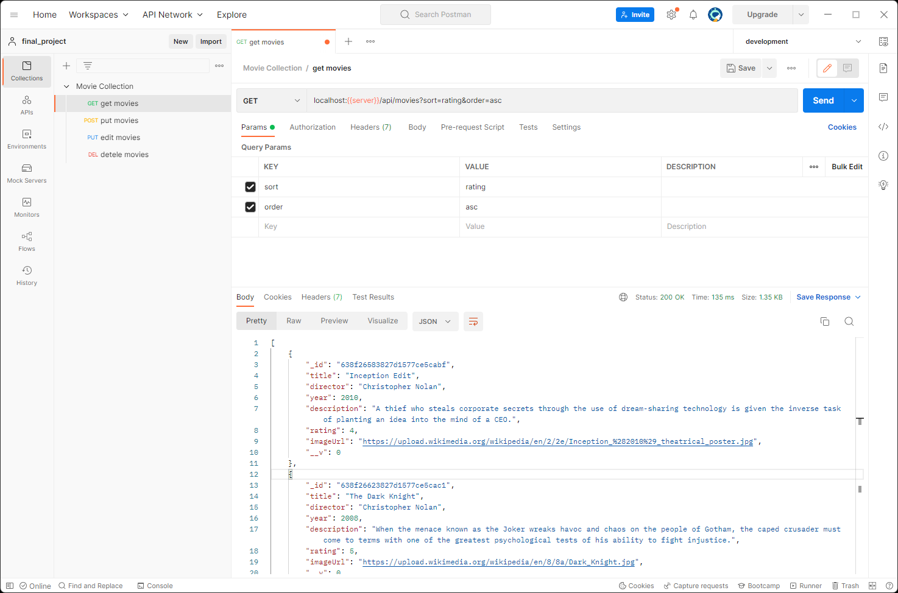

## 🔥TBD Final Project

<br>



<br>

This project is an example of a RESTful API that allows users to manage a collection of movies. It includes the following features:

-   `GET /api/movies`: Retrieves a list of movies in the collection, with optional parameters `limit`, `sort`, and `order`
-   `GET /api/movies/:id`: Retrieves a movie with the specified `id`
-   `POST /api/movies`: Creates a new movie in the collection
-   `PUT /api/movies/:id`: Updates a movie with the specified `id`
-   `DELETE /api/movies/:id`: Deletes a movie with the specified `id`
-   `GET /api/movies/search/:keyword`: Searches for movies by keyword

## Prerequisites

-   [Node.js](https://nodejs.org/en/)

## Installation

1. Clone this repository

    git clone `https://github.com/hdytrfli/TBDFinalProject`

2. Install the dependencies

    `cd repo`
    `npm install`

3. Setup the environment variables

    `cp .env.example .env`

    Edit the `.env` file to set the ` PORT``,  `MONGODB_URI`, etc.

4. Start the development server

    `npm start:server`

## Usage

-   get /api/movies

    -   `limit`: The number of movies to return (default: 10)
    -   `sort`: The field to sort by (default: `title`)
    -   `order`: The order to sort by (default: `asc`)

    ```javascript
    fetch('localhost:port/api/movies?limit=5&sort=year&order=desc')
    	.then((response) => response.json())
    	.then((movies) => console.log(movies));
    ```

-   get /api/movies/:id

    ```javascript
    fetch('localhost:port/api/movies/5c9d4d9e0f1cfc0017b660e6')
    	.then((response) => response.json())
    	.then((movie) => console.log(movie));
    ```

-   post /api/movies

    ```javascript
    fetch('localhost:port/api/movies', {
    	method: 'POST',
    	headers: {
    		'Content-Type': 'application/json',
    	},
    	body: JSON.stringify({
    		title: 'The Matrix',
    		year: 1999,
    		director: 'The Wachowskis',
    		description:
    			'A computer hacker learns from mysterious rebels about the true nature of his reality and his role in the war against its controllers.',
    		rating: 8.7,
    		imageUrl: 'https://upload.wikimedia.org/wikipedia/en/c/c1/The_Matrix_Poster.jpg',
    	}),
    })
    	.then((response) => response.json())
    	.then((movie) => console.log(movie));
    ```

-   put /api/movies/:id

    ```javascript
    fetch('localhost:port/api/movies/5c9d4d9e0f1cfc0017b660e6', {
    	method: 'PUT',
    	headers: {
    		'Content-Type': 'application/json',
    	},
    	body: JSON.stringify{
    		title: 'The Matrix Reloaded',
    		year: 2003,
    		director: 'The Wachowskis',
    		description:
                'Six months after the events depicted in The Matrix, Neo has proved to be a good omen for the free humans, as more and more humans are being freed from the matrix and brought to Zion, the one and only stronghold of the Resistance. Neo himself has discovered his superpowers including super speed, ability to see the codes of the things inside the matrix and a certain degree of pre-cognition.',
    		rating: 8.7,
    		imageUrl: 'https://upload.wikimedia.org/wikipedia/en/b/ba/The_Matrix_Reloaded_Poster.jpg',
    	}),
    })
    	.then((response) => response.json())
    	.then((movie) => console.log(movie));
    ```

-   delete /movies/:id

    ```javascript
    fetch('localhost:port/api/movies/5c9d4d9e0f1cfc0017b660e6', {
    	method: 'DELETE',
    })
    	.then((response) => response.json())
    	.then((movie) => console.log(movie));
    ```

-   get /api/movies/search/:keyword

    ```javascript
    fetch('localhost:port/api/movies/search/matrix')
    	.then((response) => response.json())
    	.then((movies) => console.log(movies));
    ```

## License

This project is licensed under the MIT License - see the [LICENSE](LICENSE) file for details.
